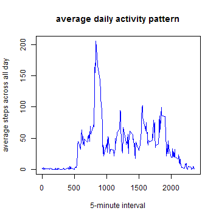
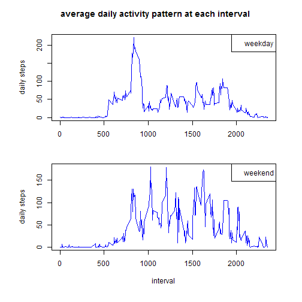

Coursera - Reproducible Data Analysis - Assignment 1
==================================================

## Load and preprocess data


```r
unzip("activity.zip")
data <- read.csv("activity.csv", colClasses = c("numeric", "character", "numeric"))
head(data, 3)
```

```
##   steps       date interval
## 1    NA 2012-10-01        0
## 2    NA 2012-10-01        5
## 3    NA 2012-10-01       10
```


-------
## Analysis the steps taken per day


```r
# caculate the sum of steps taken each day
daystep <- tapply(data$steps, data$date, sum, na.rm = T)

# result
mean <- mean(daystep)
median <- as.integer(median(daystep))  # result show as integer
hist(daystep, col = "blue", xlab = "total steps each day", ylab = "number of days")
```

 


**mean** total number of steps taken per day: 9354.2295

**median** total number of steps taken per day: 10395


-----
## Analysis average daily activity pattern


```r
# analysis the steps by intervals
intervalstep <- tapply(data$steps, data$interval, mean, na.rm = T)

# result
max <- max(intervalstep)
plot(names(intervalstep), intervalstep, type = "l", col = "blue", xlab = "5-minute interval", 
    ylab = "average steps across all day", main = "average daily activity pattern")
```

 


**maximum** average number of steps among all intervals: 206.1698 steps

-----
## Imputing missing values

### There are a number of days/intervals where data are missing.


```r
bad <- is.na(data$steps)
num <- sum(bad)
```

**number of missing values** is: 2304

### solution: impute missing values with average steps at that specific interval


```r
# get the index and the specific interval of missing values
badidx <- which(bad)
badinterval <- data[bad, ]$interval

# impute and fill in
gooddata <- data
imputestep <- numeric()
n = 1
for (idx in badidx) {
    itv <- badinterval[n]
    impute <- intervalstep[[as.character(itv)]]
    gooddata[idx, ]$steps <- impute
    n <- n + 1
}
head(gooddata, 3)
```

```
##    steps       date interval
## 1 1.7170 2012-10-01        0
## 2 0.3396 2012-10-01        5
## 3 0.1321 2012-10-01       10
```


### re-analysis the steps taken per day

```r
# analysis the steps by intervals
daystep2 <- tapply(gooddata$steps, gooddata$date, sum)

# result
mean2 <- as.integer(mean(daystep2))  # result show as integer
median2 <- as.integer(median(daystep2))
hist(daystep, col = "blue", xlab = "total steps each day", ylab = "number of days", 
    main = "histgram of daystep with imputed data")
```

 


Results differ from the estimates on unimputed data.

**new mean** of total number of steps taken per day: 10766

**new median** of total number of steps taken per day: 10766

  

  
## differences in activity patterns between weekdays and weekends


```r
# get weekdays in English
Sys.setlocale("LC_TIME", "C")  # set weekday names in English
gooddata$date <- as.Date(gooddata$date)
gooddata$weekdays <- weekdays(gooddata$date)
```


```r
# if it's weekend
weekends <- character()
for (d in 1:nrow(gooddata)) {
    day <- gooddata[d, ]$weekdays
    if (day %in% c("Sunday", "Satruday")) {
        weekends[d] <- "weekend"
    } else {
        weekends[d] <- "weekday"
    }
}
gooddata$weekends <- as.factor(weekends)

# split into weekday and weekend data.frame
w <- split(gooddata, gooddata$weekends)
dfweekday <- w$weekday
dfweekend <- w$weekend

# caculate average steps for each interval
itvstep.weekday <- tapply(dfweekday$steps, dfweekday$interval, mean)
itvstep.weekend <- tapply(dfweekend$steps, dfweekend$interval, mean)

# plot
par(mfrow = c(2, 1), mar = c(4, 4, 1, 2), oma = c(2, 2, 3, 1))
plot(names(itvstep.weekday), itvstep.weekday, type = "l", xlab = "", ylab = "daily steps", 
    col = "blue")
legend("topright", legend = "weekday")
plot(names(itvstep.weekend), itvstep.weekend, type = "l", xlab = "interval", 
    ylab = "daily steps", col = "blue")
legend("topright", legend = "weekend")
title(main = "average daily activity pattern at each interval", outer = T)
```

 

